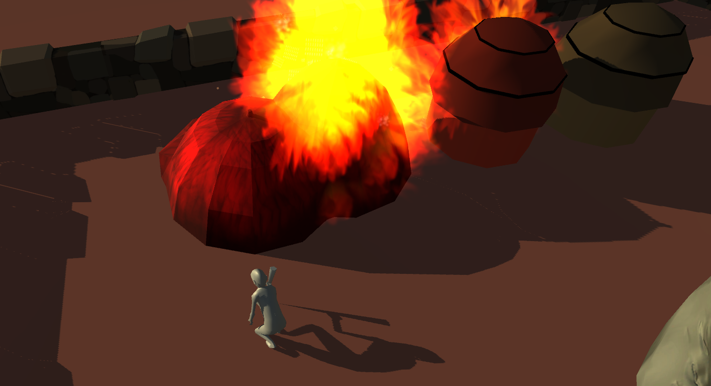

# Pyromancer <a href="https://archer01.itch.io/pyromancer">(Download game)</a>&nbsp;<a href="https://jeu-infiltration-unity.hashnode.dev/">(Dev Blog)</a>

 
  &nbsp
  &nbsp
  &nbsp
  &nbsp
  

---

## Résumé
Vous êtes un saboteur armé d'une torche devant brûler les maisons d'un village sans vous faire repérer. Les incendies se propagent et moins il y a de maisons, moins vous serez discret.

Ce git est là pour montrer la partie script du projet, tout le reste est enlevé pour des raisons de tailles acceptable sur Github, le projet unity complet est disponible ici : 
https://drive.google.com/file/d/1PcUXb42fIgDfbmdJuAXzREBndcaCyDMQ/view?usp=sharing

---

## Features
  * Jeu d'infiltration dans laquelle il faut brûler des maisons sans se faire repérer
  * Ambiance africaine avec des modèles 3D basiques

---

## Crédit
Julien Guénard : Développeur Unity
Arthur Llorens : Game Designer

---

## Liens
  * <a href="https://www.youtube.com/channel/UCwxuydeEi6WyM-X6nsPs-8A">Youtube</a>
  * <a href="https://archer01.itch.io/">Itch.io</a>
  * <a href="https://hashnode.com/@Archer01">Hashnode (Dev Blog)</a>
  * <a href="https://www.linkedin.com/in/julienguenard/">Linkedin</a>
  * <a href="https://twitter.com/julien_guenard">Twitter</a>

